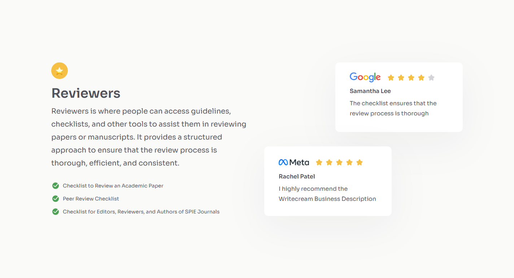
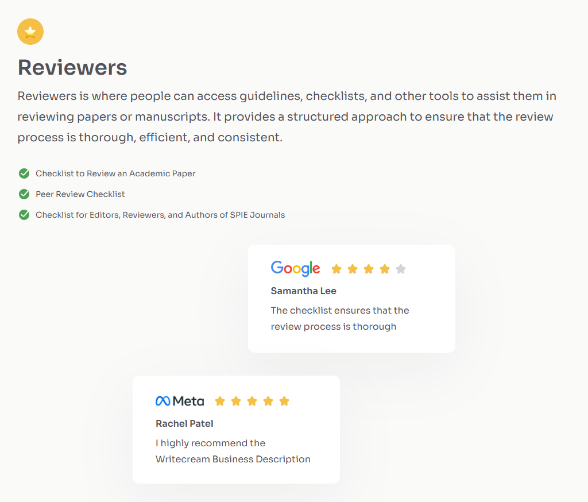
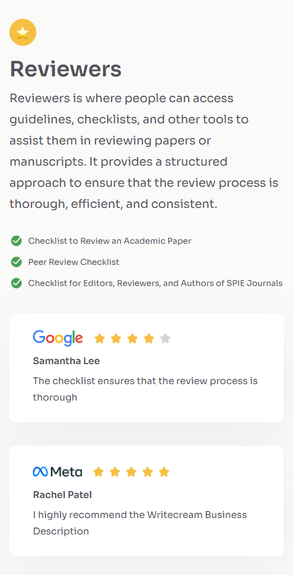

<h1 align="center">Testimonial Page | devChallenges</h1>

   Solution for a challenge <a href="https://devchallenges.io/challenge/testimonial-page" target="_blank">Testimonial Page</a> from <a href="http://devchallenges.io" target="_blank">devChallenges.io</a>.

  <h3>
    <a href="//st0272.github.io/dc-testimonial-page/">
      Demo
    </a>
     | 
    <a href="//github.io/st0272/dc-testimonial-page">
      Solution
    </a>
     | 
    <a href="//devchallenges.io/challenge/testimonial-page">
      Challenge
    </a>
  </h3>

<!-- TABLE OF CONTENTS -->

## Table of Contents

- [Table of Contents](#table-of-contents)
- [Overview](#overview)
  - [Built with](#built-with)
- [Author](#author)

<!-- OVERVIEW -->

## Overview

Desktop  

Tablet  

Mobile  

### Built with

- Semantic HTML5 markup
- CSS custom properties
- Flexbox
- CSS Grid
- [Tailwind](https://tailwindcss.com/)

## Author

- Website [your-website.com](https://{your-web-site-link})
- GitHub [@your-username](https://{github.com/your-usermame})
